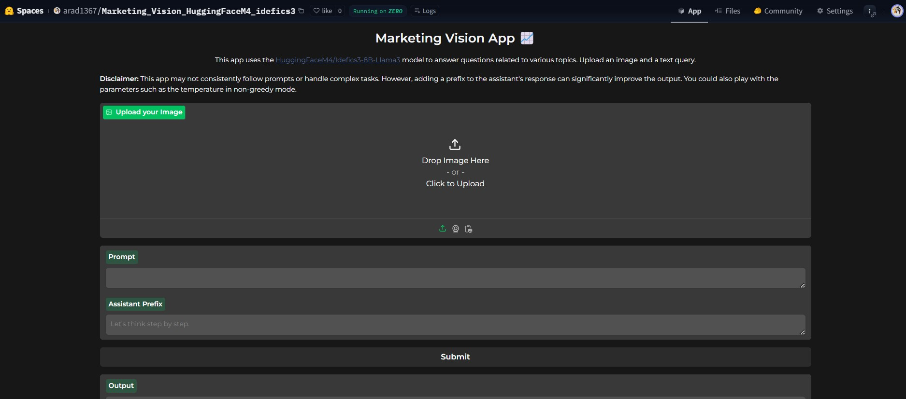

# Marketing Vision App

## Overview

The Marketing Vision App is a powerful tool that leverages the capabilities of the [HuggingFaceM4/Idefics3-8B-Llama3](https://huggingface.co/HuggingFaceM4/Idefics3-8B-Llama3) model and the work of Merve Noyan [link to her app](https://huggingface.co/merve). This app allows users to upload an image and a text query to generate insights and answers related to various marketing topics.

## Features

- Utilizes the HuggingFaceM4/Idefics3-8B-Llama3 model for generating responses.
- Modifications made to the UI.
- Built using the Gradio SDK and deployed on Huggingface Space.
- Supports advanced generation parameters for customizing the output.

## Demo

You can try out the live demo of the Marketing Vision App [here](https://huggingface.co/spaces/arad1367/Marketing_Vision_HuggingFaceM4_idefics3).

## Getting Started

To run the app locally, follow these steps (`Needs GPU`):

1. Clone this repository:

   `git clone https://github.com/your-username/marketing-vision-app.git`

2. Install the required dependencies:

    `pip install -r requirements.txt`

3. Run the app:

    `python app.py`

## Credits and Contact
* `HuggingFaceM4/Idefics3-8B-Llama3`
* The app is inspired from `Merve Noyan` code.
* For any questions or inquiries, please feel free to contact me on LinkedIn [here](https://www.linkedin.com/in/pejman-ebrahimi-4a60151a7/).

## License
* This project is licensed under the Apache-2.0 License .